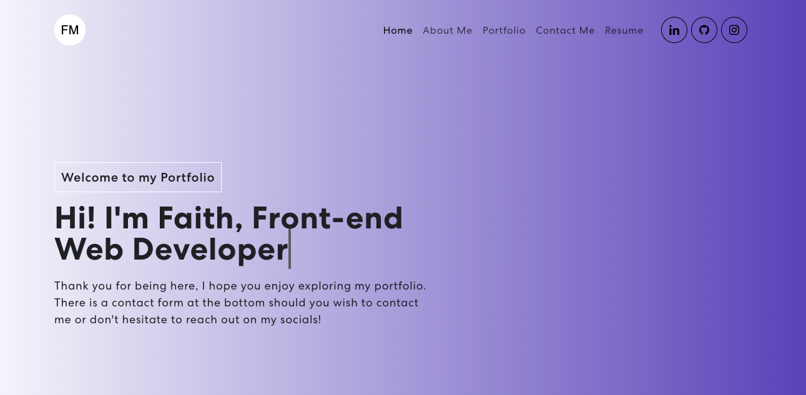

# React Portfolio

## Description

This is a single page application that has been created for my week 20 assignment. This applcation uses various front-end technologies to create a portfolio.

## Table of Contents

- [Title](#title)
- [Description](#description)
- [Installation](#installation)
- [Usage](#usage)
- [Tests](#tests)
- [Demo](#demo)
- [Contributing](#contributing)
- [Questions](#questions)

## Installation

To use this application you will need to use VS Code, node, React, MERN, and react bootstrap, bootstrap. The dependencies are all in the package.json file and can beinstalled using npm i when cd'd into the folder.

## Usage

You use this application by clicking each element in the nav bar and checking it corresponds to the correct section. You can also click thorugh the skills section to see what has been highlighted. You will always be able to complete a contact form.

## Tests

You can test this application by clicking through each element and ensuring it goes to the correct places, you should also receieve an error message if you leave out information required on the form. You can also ensure that all links for the projects work.

## Demo

[React Portfolio Brief Video](https://youtu.be/TFvMo6GZW2g)

## Contributing

Faith Meades

## Questions

- Username: FaithsCoding
- [GitHub Repo](www.github.com/react-portfolio-version2)
- You can send me any questions via email: faithscoding@outlook.com
